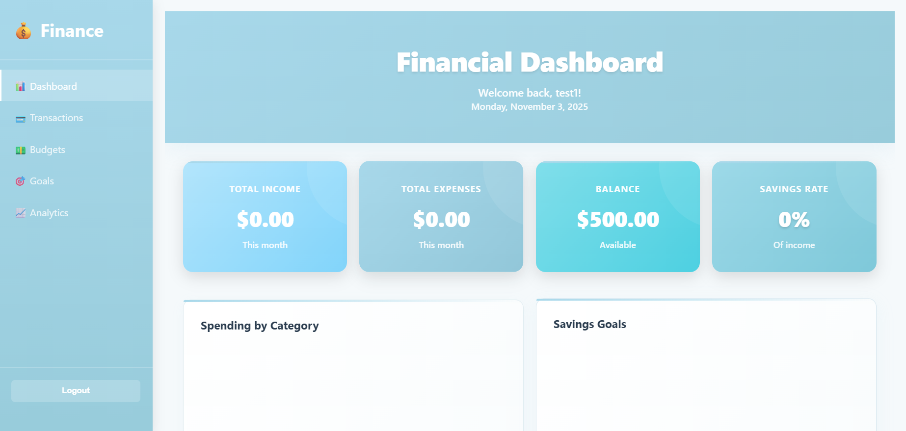

# 💰 Personal Finance Dashboard



A professional-grade full-stack finance management application designed for individuals and small businesses. Built with modern web technologies, this dashboard provides comprehensive financial tracking, analytics, and reporting capabilities.

**[Features](#-features)** | **[Tech Stack](#-technology-stack)** | **[Installation](#-installation)** | **[API Docs](#-api-endpoints)**

---

## ✨ Features

### 📊 **Dashboard**
- Real-time financial summary with key metrics
- Income vs. Expenses overview
- Current balance and monthly trends
- Quick access to all financial data
- Responsive cards with gradient designs

### 💳 **Transaction Management**
- Log income and expense transactions
- Organize by category (Food, Transportation, Entertainment, etc.)
- Add detailed descriptions for every transaction
- View complete transaction history
- Edit or delete transactions anytime
- Filter transactions by type and date

### 📈 **Advanced Analytics** (8 Interactive Charts)
- **12-Month Income vs Expenses Trend**: Line chart showing income and expense patterns over 12 months
- **Income vs Expenses Distribution**: Doughnut chart visualizing proportion of income to spending
- **Monthly Savings Growth**: Combined bar and line chart tracking savings accumulation
- **Top Expense Categories**: Horizontal bar chart showing highest spending categories
- **Budget Performance Radar**: Radar chart comparing budget limits vs actual spending
- **Goals Achievement Progress**: Bar chart displaying progress toward savings goals
- **Income Sources Breakdown**: Pie chart showing income distribution by source
- **Category Spending Trend**: Multi-line chart tracking spending patterns per category over time
- **Financial Summary Statistics**: 10 key metrics including total income, expenses, savings rate, etc.

### 💵 **Budget Management**
- Set monthly spending limits by category
- Real-time budget vs actual spending comparison
- Visual indicators showing budget status (on-track, warning, over-budget)
- Manage multiple budget categories
- Delete or update budgets
- Color-coded performance metrics

### 🎯 **Savings Goals**
- Create custom savings goals with target amounts
- Set optional deadlines
- Track progress with visual indicators
- Add funds incrementally toward goals
- Color-coded progress bars (green: on-track, yellow: 50-75%, red: under 50%)
- Monitor multiple goals simultaneously

### 🔐 **User Authentication**
- Secure signup/login system
- Password hashing with industry-standard encryption
- Session-based authentication
- Per-user data isolation
- Logout functionality

### 🎨 **Professional UI/UX**
- Modern pastel blue gradient theme
- Smooth animations and transitions
- Responsive design (desktop, tablet, mobile)
- Clean sidebar navigation
- Card-based layout with hover effects
- Intuitive tab-based interface

---

## 🏗️ Architecture

### Full-Stack Application
```
Frontend (Client-Side)
├── HTML5 Templates
├── CSS3 with animations
├── Vanilla JavaScript (AJAX)
└── Chart.js for visualizations

↓ (RESTful API)

Backend (Server-Side)
├── Flask 2.3.2
├── SQLAlchemy ORM
├── Session Management
└── Database Operations

↓ (Data Persistence)

Database
└── SQLite with multi-user support
```

---

## 💻 Technology Stack

| Layer | Technology | Purpose |
|-------|-----------|---------|
| **Frontend** | HTML5, CSS3, JavaScript | User Interface & Interactions |
| **Visualization** | Chart.js | Interactive Data Visualizations |
| **Backend** | Python, Flask 2.3.2 | REST API & Business Logic |
| **ORM** | SQLAlchemy 3.0.5 | Database Object Mapping |
| **Database** | SQLite | Data Persistence |
| **Security** | Werkzeug | Password Hashing & Sessions |
| **HTTP** | Fetch API | Client-Server Communication |

---

## 🚀 Installation

### Prerequisites
- Python 3.7 or higher
- pip (Python package manager)
- Git (optional)

### Step-by-Step Setup

1. **Clone or download the repository**
   ```bash
   git clone https://github.com/yor1shiro/finance-dashboard.git
   cd finance-dashboard
   ```

2. **Create a virtual environment (recommended)**
   ```bash
   python -m venv venv
   source venv/bin/activate  # On Windows: venv\Scripts\activate
   ```

3. **Install dependencies**
   ```bash
   pip install -r requirements.txt
   ```

4. **Run the application**
   ```bash
   python app.py
   ```

5. **Open in your browser**
   Navigate to `http://localhost:5000`

6. **Create an account**
   - Click "Sign Up" on the login page
   - Enter a username, email, and password
   - Click "Sign Up"
   - You're ready to start tracking your finances!

---

## 📁 Project Structure

```
womenji/
├── app.py                          # Flask backend (345 lines)
│   ├── Database models (User, Transaction, Budget, SavingsGoal)
│   ├── Authentication endpoints (signup, login, logout)
│   ├── CRUD endpoints for all entities
│   └── Analytics endpoints
│
├── requirements.txt                # Python dependencies
├── finance.db                      # SQLite database (auto-created)
│
├── templates/
│   ├── auth.html                   # Login/Signup interface
│   └── dashboard.html              # Main dashboard (222 lines)
│       ├── Sidebar navigation
│       ├── Dashboard tab
│       ├── Transactions tab
│       ├── Budgets tab
│       ├── Goals tab
│       └── Analytics tab
│
└── static/
    ├── css/
    │   ├── style.css               # Dashboard styling (891 lines)
    │   └── auth.css                # Auth page styling
    │
    └── js/
        ├── dashboard.js            # Dashboard logic (814 lines)
        └── auth.js                 # Auth logic
```

---

## 🔌 API Endpoints

### Authentication
| Method | Endpoint | Description |
|--------|----------|-------------|
| POST | `/api/auth/signup` | Create new user account |
| POST | `/api/auth/login` | User login |
| POST | `/api/auth/logout` | User logout |
| GET | `/api/auth/me` | Get current user info |

### Dashboard
| Method | Endpoint | Description |
|--------|----------|-------------|
| GET | `/api/dashboard` | Get financial summary |

### Transactions
| Method | Endpoint | Description |
|--------|----------|-------------|
| GET | `/api/transactions` | Get all transactions |
| POST | `/api/transactions` | Add new transaction |
| DELETE | `/api/transactions/<id>` | Delete transaction |

### Budgets
| Method | Endpoint | Description |
|--------|----------|-------------|
| GET | `/api/budgets` | Get all budgets |
| POST | `/api/budgets` | Create new budget |
| DELETE | `/api/budgets/<id>` | Delete budget |

### Savings Goals
| Method | Endpoint | Description |
|--------|----------|-------------|
| GET | `/api/goals` | Get all goals |
| POST | `/api/goals` | Create new goal |
| PUT | `/api/goals/<id>` | Update goal progress |
| DELETE | `/api/goals/<id>` | Delete goal |

### Analytics
| Method | Endpoint | Description |
|--------|----------|-------------|
| GET | `/api/analytics/monthly` | Get 12-month analytics data |

---

## 🎯 How to Use

### Getting Started
1. **Sign up** with your username, email, and password
2. **Log in** to access your dashboard
3. **Start adding data** - transactions, budgets, and goals

### Dashboard Tab
- View your complete financial overview
- Check total income, expenses, and balance
- See spending breakdown by category
- Monitor savings goals progress

### Transactions Tab
- Click "Add Transaction" to log income or expenses
- Select a category (e.g., Food, Transportation)
- Enter the amount and add a description
- View all transactions in the list below
- Delete transactions using the delete button

### Budgets Tab
- Click "Add Budget" to set category limits
- Enter a category and monthly limit
- See real-time comparison of budget vs spending
- Color indicators show budget status:
  - 🟢 Green: Spending is within budget
  - 🟡 Yellow: Near budget limit
  - 🔴 Red: Over budget

### Goals Tab
- Click "Add Goal" to create a savings target
- Enter goal name and target amount
- Set an optional deadline
- Add funds toward the goal over time
- Track progress with the visual progress bar

### Analytics Tab
- View 8 different financial charts
- See 12-month trends in your data
- Analyze spending by category
- Track income sources
- Monitor budget performance
- View financial summary statistics

---

## 🔐 Security Features

- **Password Hashing**: Werkzeug bcrypt for secure password storage
- **Session Management**: Server-side session handling
- **Login Required**: All protected routes require authentication
- **CSRF Protection**: Secure cookie handling
- **Per-User Data Isolation**: Each user's data is completely isolated from others

---

## 🎨 Design Highlights

### Color Scheme
- **Primary**: Pastel Blue (#a8d8ea)
- **Secondary**: Light Blue (#b3e5fc)
- **Accent**: Soft Pink (#f5a5a5)
- **Success**: Light Green (#81c784)
- **Warning**: Light Yellow (#ffd54f)

### Animations
- Smooth slide-in effects on page load
- Hover animations on interactive elements
- Transition effects on tab switches
- Shimmer effect on loading states

### Responsive Design
- Mobile-first approach
- Adaptive grid layouts
- Touch-friendly buttons and inputs
- Optimized for all screen sizes

---

## 📊 Sample Workflow

1. **Add Monthly Income**
   - Transaction: Salary $5,000 (Income)

2. **Set Budgets**
   - Food: $600/month
   - Transportation: $400/month
   - Entertainment: $200/month

3. **Log Daily Expenses**
   - Groceries $80 (Food)
   - Gas $50 (Transportation)
   - Movie $20 (Entertainment)

4. **Create Savings Goals**
   - Emergency Fund: $5,000 target
   - Vacation: $2,000 target

5. **Monitor Analytics**
   - View spending trends
   - Check budget performance
   - Track goal progress
   - Analyze income vs expenses

---

## 🚀 Deployment

### Deploy to Heroku
```bash
heroku login
heroku create your-app-name
git push heroku main
```

### Deploy to PythonAnywhere
1. Create account at pythonanywhere.com
2. Upload files via Web UI
3. Configure WSGI file
4. Access your live app

### Deploy to Railway
1. Connect GitHub repository
2. Railway auto-detects Python
3. Deploy automatically

### Deploy to Render
1. Connect repository
2. Select Flask as service
3. Auto-redeploy on push

---

## 🔧 Customization

### Change Theme Colors
Edit `static/css/style.css` and update CSS variables

### Add New Transaction Categories
Edit `app.py` and update the category options

### Modify Chart Displays
Edit chart functions in `static/js/dashboard.js`

### Update Dashboard Layout
Modify HTML structure in `templates/dashboard.html`

---

## 📈 Future Enhancement Ideas

- [ ] CSV/PDF export of financial reports
- [ ] Email notifications for budget alerts
- [ ] Recurring transaction automation
- [ ] Financial forecasting and recommendations
- [ ] Multiple currencies support
- [ ] Dark mode theme
- [ ] Mobile app version
- [ ] Bank account integration
- [ ] Investment tracking
- [ ] Advanced filtering and search

---

## 🐛 Troubleshooting

### Port 5000 already in use
```bash
# Windows
netstat -ano | findstr :5000
taskkill /PID <PID> /F

# Or use different port
python app.py  # Edit app.py to use port 5001
```

### No module named Flask
```bash
pip install -r requirements.txt
```

### Database locked error
```bash
rm finance.db  # Delete and recreate
python app.py
```

---

## 📄 License

This project is licensed under the MIT License - see the LICENSE file for details.

---

## 🤝 Contributing

Contributions welcome! Please:
1. Fork the repository
2. Create a feature branch
3. Commit your changes
4. Push to the branch
5. Open a Pull Request

---

## 👨‍💻 Portfolio Highlights

**This project demonstrates:**
- ✅ Full-stack web development (frontend + backend)
- ✅ Database design and management with SQLAlchemy ORM
- ✅ RESTful API development with Flask
- ✅ User authentication and security best practices
- ✅ Frontend UI/UX design with CSS animations
- ✅ Data visualization with Chart.js
- ✅ Responsive web design principles
- ✅ Session management and per-user data isolation
- ✅ Clean code architecture and project organization

---


**Built with ❤️ for financial freedom**

*Last Updated: November 2025*
